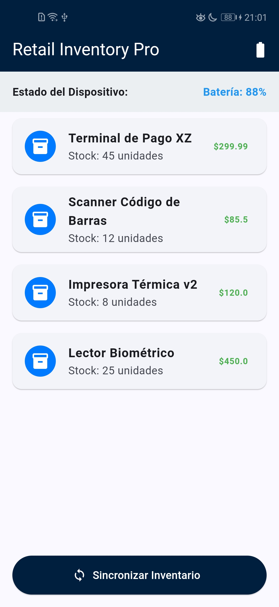
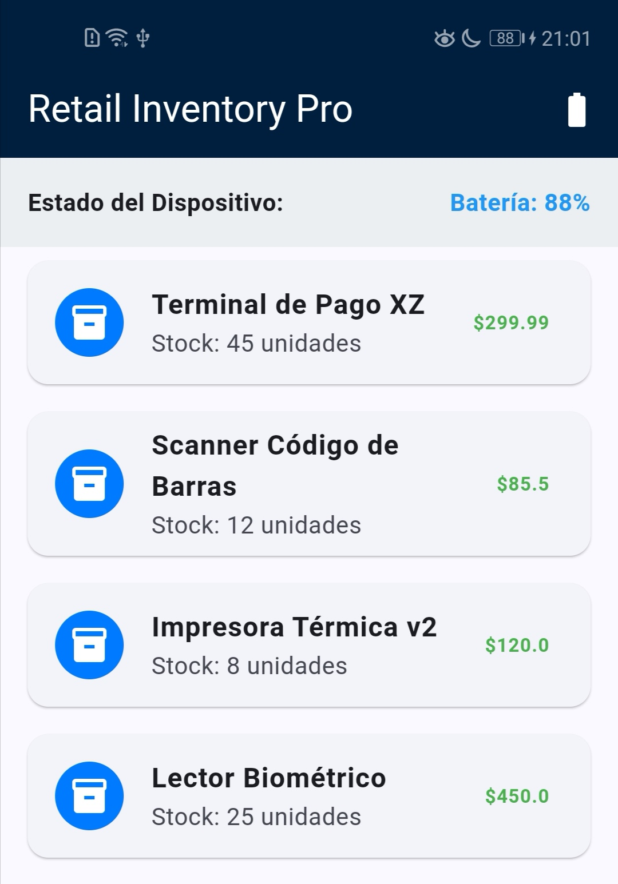

# Retail Bridge Pro 

**Ingeniería de Sistemas | Mobile Architecture Showcase**

Este proyecto demuestra la integración avanzada entre el framework **Flutter** y el sistema operativo **Android (Nativo)** mediante el uso de `Platform Channels`. Diseñado bajo los estándares de escalabilidad requeridos en sectores como la Banca y el Retail.

## Tecnologías Destacadas
- **Flutter & Dart:** Para una interfaz de usuario reactiva y moderna.
- **Java (Android Nativo):** Implementación de servicios de hardware mediante `MethodChannel`.
- **Arquitectura Offline-First:** Gestión de datos mediante JSON local y simulador de sincronización asíncrona.

## Desafíos Técnicos Resueltos
1. **Comunicación Bidireccional:** Inyección de lógica nativa en Java dentro del motor de Flutter para consultar el estado del hardware (Batería/Sistema).
2. **UX en Retail:** Implementación de estados de carga (`isSyncing`) y manejo de asincronía para evitar el bloqueo del hilo principal de la interfaz.
3. **Gestión de Recursos:** Estructura modular para facilitar la migración de datos locales a servicios RESTful en el futuro.

## Capturas de Pantalla

  
  

---
Desarrollado por **Hansel Alain Bustamante** - Ingeniero de Sistemas (UMSA).
